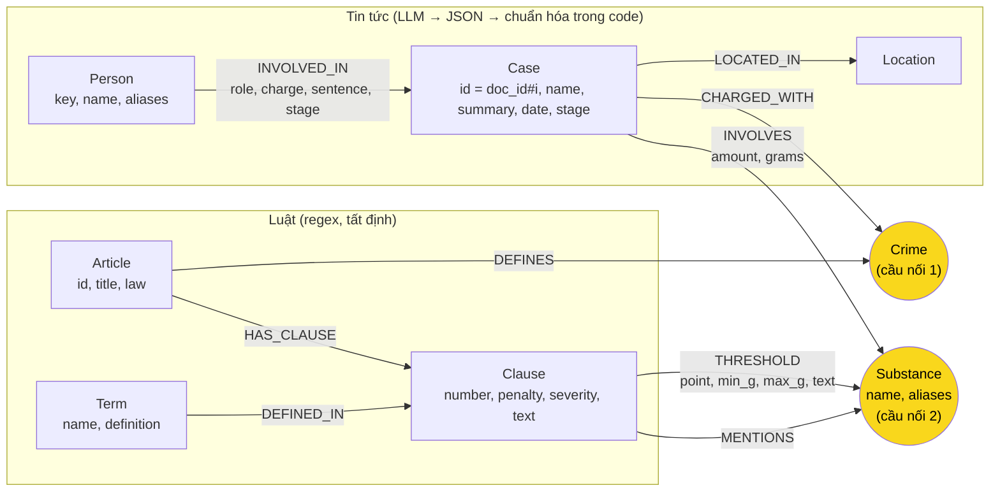

# Thiết kế Ontology — Day 19

**Họ tên:** Trần Anh Vũ  **MSSV:** 2A202602570

**Lựa chọn** (đánh dấu một):
- [ ] Dùng ontology gợi ý (có thể chỉnh nhỏ)
- [x] Tự thiết kế (xét bonus +15, xem `SUBMISSION.md`)

> Code: `src/graph.py`: `_build_graph_custom`, `parse_law_article_custom`, `extract_news_cases_custom`, `Neo4jGraph.add_*_custom`, `Neo4jGraph._context_custom`. Ontology gợi ý vẫn giữ nguyên trong code để làm baseline, bật bằng `KG_ONTOLOGY=hint` (đã dùng để sinh `ket_qua_benchmark_kg.hint.txt`). Mặc định (không đặt biến) là ontology dưới đây.

## 1. Sơ đồ

## 2. Entity types (node labels)

| Label | Ý nghĩa | Khóa định danh (`MERGE` theo) | Properties | Lấy từ KB nào | Trích bằng (regex / LLM / khác) |
| --- | --- | --- | --- | --- | --- |
| `Article` | Một Điều luật | `id` ("Điều 251 BLHS") | `title`, `law`, `doc_id` | Luật | regex (front matter + tiêu đề) |
| `Clause` | Một khoản của Điều | `id` ("Điều 251 BLHS khoản 4") | `number`, `penalty`, **`severity`** (tử hình 100, chung thân 50, còn lại = số năm tù tối đa, 0 nếu không phạt tù), `text`, `doc_id` | Luật | regex `^(\d+)\.\s` + `penalty_severity()` |
| `Crime` | Tội danh chuẩn (tên tội trong tiêu đề Điều BLHS) | `name` (đã `normalize_crime`) | – | Luật | regex tiêu đề "Tội …" |
| `Term` **(mới)** | Thuật ngữ được định nghĩa tại Điều 2 Luật PCMT "Giải thích từ ngữ" | `name` ("Tiền chất") | `definition`, `doc_id` | Luật | regex `^\d+\.\s+(.+?) là ` |
| `Substance` | Chất ma túy (tên chuẩn theo BLHS) | `name` chuẩn hóa (`canonical_substance`) | **`aliases`** (cách báo viết) | Cả hai | luật: `find_substances`; tin: LLM rồi bảng đồng nghĩa `SUBSTANCE_ALIASES` + `link_entity` |
| `Case` | Một vụ việc cụ thể trong một bài báo | **`id` = `"<doc_id>#<thứ tự>"`** (không dùng tên do LLM đặt) | `name`, `summary`, `date`, **`stage`**, `doc_id`, `source_title` | Tin | LLM |
| `Person` | Bị cáo / bị can / nghi phạm / người liên quan | **`key`** = họ tên NFC + lowercase + gộp khoảng trắng | `name` (hiển thị), `aliases` (biệt danh, gộp dần qua các bài) | Tin | LLM, chuẩn hóa `person_key` |
| `Location` | Tỉnh / thành phố | `name` | – | Tin | LLM |

Node dùng chung giữa nhiều tài liệu (`Crime`, `Substance`, `Person`, `Location`) **không** có `doc_id` (một node, nhiều nguồn); mọi node sinh ra từ đúng một tài liệu (`Article`, `Clause`, `Term`, `Case`) đều có `doc_id` theo hợp đồng.

## 3. Relationships

| Type | Từ → Đến | Properties trên cạnh | Ý nghĩa |
| --- | --- | --- | --- |
| `DEFINES` | Article → Crime | – | Điều luật định nghĩa tội danh |
| `HAS_CLAUSE` | Article → Clause | – | Điều gồm các khoản |
| `THRESHOLD` **(mới)** | Clause → Substance | `point` (điểm a/b/c…), `min_g`, `max_g` (gam; `null` = "trở lên"), `text` (nguyên văn điểm) | Khoản áp dụng khi khối lượng chất nằm trong `[min_g, max_g)` |
| `MENTIONS` | Clause → Substance | – | Khoản nhắc tên chất nhưng **không** có ngưỡng khối lượng (ví dụ Điều 247 trồng cây) |
| `DEFINED_IN` **(mới)** | Term → Clause | – | Thuật ngữ được giải thích tại khoản này |
| `CHARGED_WITH` | Case → Crime | – | Vụ việc bị khởi tố / truy tố / xét xử về tội này |
| `INVOLVES` | Case → Substance | `amount` (nguyên văn), **`grams`** (số, do code parse) | Chất và khối lượng trong vụ |
| `LOCATED_IN` | Case → Location | – | Nơi xảy ra |
| `INVOLVED_IN` | Person → Case | `role`, `charge`, `sentence`, **`stage`** | Vai trò, tội danh riêng, mức án riêng của từng người, ở giai đoạn tố tụng nào |

## 4. Node cầu nối giữa 2 KB

- **Node nào:** hai cầu nối. `Crime` (chính) nối vụ → Điều luật; `Substance` (phụ) nối vụ → **khoản** cụ thể qua `INVOLVES.grams` × `THRESHOLD [min_g, max_g)`.
- **Vì sao chọn node này:** đáp án xuyên KB cần (a) *Điều nào* thì chỉ tội danh mới xác định được; (b) *khoản nào* thì phụ thuộc chất + khối lượng. Ontology gợi ý chỉ có (a) và lấy khoản theo kiểu "khoản có nhắc tên chất", nên với MDMA ra cả 4 khoản (khoản nào của Điều 250 cũng nhắc MDMA). Cầu nối thứ hai chọn **đúng một** khoản.
- **Cách đảm bảo hai phía khớp tên:**
  - Tội danh: đưa danh sách 13 tên tội chuẩn vào prompt, rồi luôn cho qua `link_entity` (chuẩn hóa hai phía, khớp chính xác, sau đó `difflib` cutoff 0.8, không đủ giống thì trả `None`).
  - Chất: bảng `SUBSTANCE_ALIASES` (thuốc lắc→MDMA, ma túy đá→Methamphetamine, ketamin→Ketamine, heroin→Heroine…), bỏ tên chung chung ("ma túy", "ma túy tổng hợp"), tách ngoặc ("ma túy (ketamine)"→Ketamine), sau đó `link_entity` với `normalize_substance` (NFC, lowercase, `tuý`→`túy`).
  - Khối lượng: `parse_grams` đổi "hơn 9,6kg"→9600, "0,686g"→0.686, "1.200 gam"→1200; "5 viên" → `null` (không so ngưỡng).
- **Khi nào cầu gãy, và bạn xử lý thế nào:**
  - Bài báo dùng tội ngoài Chương XX (hối lộ, giết người…) → không có `CHARGED_WITH`. Đây là gãy **hợp lý**; context vẫn trả tóm tắt vụ + chunk vector.
  - LLM không trả tội danh dù bài có (lỗi E1 trong REPORT_KG.md) → vụ không có Điều. Hiện chỉ phát hiện được bằng Cypher `WHERE NOT (k)-[:CHARGED_WITH]->()`; đề xuất: fallback `link_entity` trên các cụm "tội …" trích bằng regex từ chính bài.
  - Khối lượng không đổi được ra gam ("5 viên", không nêu) → cầu `Substance` gãy, context vẫn có khoản 1 + khoản nặng nhất của Điều (thông qua `Crime`), nên không mất khung hình phạt.

## 5. Competency questions

| Câu | Đường đi (Cypher pattern) | Trả lời được? |
| --- | --- | --- |
| Q1 | `(:Term {name:'Tiền chất'})-[:DEFINED_IN]->(:Clause)<-[:HAS_CLAUSE]-(:Article {id:'Điều 2 Luật PCMT'})`. Seed: tên Term xuất hiện trong câu hỏi | Có (ontology gợi ý: không có đường, graph chỉ thêm nhiễu; benchmark hint trả "Không đủ thông tin") |
| Q2 | `(:Person)-[:INVOLVED_IN {sentence:'tử hình'}]->(:Case {doc_id:'news-100260928173914514'})`. Seed: `doc_id` từ vector search | Có (chủ yếu nhờ chunk vector; graph xác nhận mức án từng người) |
| Q3 | `(:Person {key:'lê minh thành'})-[:INVOLVED_IN {sentence}]->(:Case)-[:CHARGED_WITH]->(:Crime)<-[:DEFINES]-(:Article)-[:HAS_CLAUSE]->(:Clause {number:1})` | Có |
| Q4 | `(:Person {aliases ∋ 'Hoàng Nato'})-[:INVOLVED_IN]->(:Case)-[:CHARGED_WITH]->(:Crime)<-[:DEFINES]-(:Article {id:'Điều 255 BLHS'})-[:HAS_CLAUSE]->(cl:Clause)` với `cl.severity = max(severity)` của Điều | Có (ontology gợi ý: không lấy khoản 4, nên trả "tối đa 07 năm") |
| Q5 | `(:Person {key:'cái quang huy'})-[:INVOLVED_IN]->(k:Case)-[:CHARGED_WITH]->(:Crime)<-[:DEFINES]-(a:Article)-[:HAS_CLAUSE]->(cl:Clause)-[t:THRESHOLD]->(s:Substance)<-[i:INVOLVES]-(k)` với `i.grams >= t.min_g AND (t.max_g IS NULL OR i.grams < t.max_g)` → Điều 250 khoản 4 điểm b | Có, và chọn **một** khoản theo khối lượng (gợi ý: đưa cả 4 khoản cho LLM tự so) |
| Q6 | `(:Substance {name:'MDMA'})<-[:INVOLVES]-(k:Case)` (seed: tên chất trong câu hỏi; alias "thuốc lắc" cũng gộp về MDMA) | Có trên graph; câu trả lời cuối vẫn phụ thuộc LLM (xem E5) |

Ontology **không** trả lời được: ngưỡng cho chất không có trong danh sách BLHS (Ketamine, etomidate thuộc "các chất ma túy khác ở thể rắn": chưa mô hình hóa); tình tiết định khung không phải khối lượng ("có tổ chức", "qua biên giới", "tái phạm"); tổng khối lượng nhiều chất (điểm "có 02 chất ma túy trở lên"). Chấp nhận vì không câu nào trong benchmark cần, và trích các tình tiết đó từ tin cần LLM suy luận pháp lý, rủi ro sai cao.

## 6. Quyết định thiết kế và đánh đổi

1. **Khóa `Case` = `doc_id#i` thay vì tên vụ do LLM đặt.**
   *Phương án khác:* khóa theo tên (gợi ý), hoặc gộp vụ xuyên bài bằng LLM/embedding.
   *Vì sao:* tên LLM đặt không ổn định giữa các lần chạy và hai bài có thể ra cùng một tên chung chung ("Vụ tổ chức sử dụng ma túy…"), khi đó `MERGE` gộp nhầm và `SET doc_id` ghi đè nguồn. Khóa theo tài liệu thì tất định. *Đánh đổi:* cùng một vụ ngoài đời được nhiều bài đưa tin (Hoàng Nato: 4 bài) thành 4 node `Case`. Hậu quả được giảm nhờ `Person` gộp xuyên bài (Dương Minh Tuấn nối tới cả 4 Case); xem E3.
2. **Mô hình hóa ngưỡng khối lượng bằng cạnh `THRESHOLD {min_g, max_g}` + `INVOLVES.grams` (không dùng node `Threshold` riêng).**
   *Phương án khác:* để nguyên `MENTIONS` và cho LLM tự so khối lượng trong prompt (gợi ý); hoặc node `Point` cho mỗi điểm a/b/c.
   *Vì sao:* so sánh số trong Cypher tất định và rẻ; prompt chỉ nhận đúng khoản áp dụng, nên in_tok mỗi câu giảm từ 3991 (hint) xuống 1838. Node `Point` làm graph to thêm ~300 node mà không trả lời thêm câu nào. *Đánh đổi:* regex chỉ hiểu "gam/kilôgam", bỏ qua thể tích "mililít"; một chất có thể có nhiều ngưỡng trong cùng khoản (nhựa cần sa vs lá cần sa), vì `find_substances` không phân biệt dạng.
3. **Clause có `severity` và context luôn lấy khoản 1 + khoản nặng nhất + khoản khớp ngưỡng.**
   *Phương án khác:* lấy hết khoản (đủ nhưng dài), hoặc chỉ khoản 1 + khoản nhắc chất (gợi ý).
   *Vì sao:* câu hỏi pháp lý hay hỏi "cơ bản" hoặc "tối đa"; quy tắc gợi ý làm mất khung tối đa của Điều 255 (khoản 4 không nhắc chất nào), đúng lỗi E2. Thêm tối đa 2 dòng ngắn (chỉ `penalty`, không chép cả `text`).
4. **Chuẩn hóa tên ở code, không tin LLM.** Danh sách chuẩn vẫn đưa vào prompt, nhưng mọi tội danh/chất/người đều đi qua `link_entity`/bảng alias/`person_key`, và giá trị placeholder ("chuỗi rỗng", "không rõ") bị lọc. *Lý do:* lần chạy đầu, LLM chép nguyên chữ "chuỗi rỗng" từ prompt thành tên một `Person` và một `Substance`.
5. **Thêm `Term` cho Điều 2 Luật PCMT.** Rẻ (regex, 14 node) và biến câu định nghĩa thành tra cứu chính xác. Ngược lại, ontology gợi ý làm GraphRAG **thua** Flat ở Q1.

## 7. So với ontology gợi ý (bắt buộc nếu xét bonus)

Số liệu "trước" lấy từ `ket_qua_benchmark_kg.hint.txt` (`KG_ONTOLOGY=hint`), "sau" lấy từ `ket_qua_benchmark_kg.txt`. Cùng model `gpt-4o-mini`, `text-embedding-3-small`, top_k=3, 176 chunk.

| Điểm khác | Gợi ý làm gì | Bạn làm gì | Vấn đề nó giải quyết | Bằng chứng (Cypher, hoặc số liệu benchmark) |
| --- | --- | --- | --- | --- |
| Ngưỡng khối lượng | `Clause-[:MENTIONS]->Substance`, không có số | `Clause-[:THRESHOLD {point,min_g,max_g}]->Substance` + `INVOLVES.grams` | Chọn đúng khoản theo khối lượng; prompt ngắn hơn | Cypher ngưỡng (REPORT_KG mục 3, E2) trả `Cái Quang Huy, MDMA, hơn 9,6kg → Điều 250 khoản 4 điểm b`. Q5 graph: hint đưa toàn văn 4 khoản; custom đưa 1 dòng "ÁP DỤNG… điểm b". in_tok/câu 3991 → **1838** |
| Khung nặng nhất | Chỉ khoản 1 + khoản nhắc chất | `Clause.severity`, luôn lấy khoản max | Q4 sai khung tối đa (E2) | Q4 graph: hint "tối đa **07 năm** theo Điều 255 khoản 1" (recall 0.67, judge 1) → custom "tối đa **20 năm hoặc tù chung thân** theo Điều 255" (recall 1.00, judge 2) |
| Gộp tên chất đồng nghĩa | `MERGE` theo tên LLM trả về | `canonical_substance` (bảng alias + bỏ tên chung + `link_entity`) | Trùng thực thể `Substance` (E3) | `MATCH (s:Substance) RETURN s.name`: hint **17** node gồm `Ketamine`/`ketamine`, `Methamphetamine`/`methamphetamine`, `thuốc lắc`, `ma túy`, `chất ma túy`, `ma túy tổng hợp` → custom **11** node, không trùng, không tên chung |
| Khóa Case / Person | Case theo tên LLM; Person theo tên thô | Case `doc_id#i`; Person `key` chuẩn hóa NFC + lowercase, gộp `aliases` | Khóa không ổn định; nối người xuyên bài | Custom: `Dương Minh Tuấn` (aliases `Hoàng Nato`) nối 4 Case từ 4 bài; `Cái Quang Huy` nối 2 Case. Hint: 14 Case / 20 bài, custom 17 Case (bài chứa 2 vụ được tách đúng thành `#0`, `#1`) |
| Thuật ngữ | Không có | `Term-[:DEFINED_IN]->Clause` | Câu định nghĩa (Q1) | Q1 graph: hint "Không đủ thông tin." (recall 0.00, judge 0) → custom trả đúng định nghĩa, trích "Điều 2 Luật PCMT khoản 4" (recall 1.00, judge 2) |
| Giai đoạn tố tụng | Không phân biệt | `Case.stage`, `INVOLVED_IN.stage` (bắt giữ / khởi tố / truy tố / sơ thẩm / phúc thẩm / khác) | Phân biệt "bị bắt" với "bị tuyên án" | `MATCH (k:Case) RETURN k.stage, count(*)`: các vụ Hoàng Nato = `bắt giữ`, vụ Lê Minh Thành = `xét xử phúc thẩm` |
| **Tổng** | | | | Query: recall **0.67 → 1.00**, judge **1.17 → 2.00**, USD/câu **0.00063 → 0.00032**. Indexing: 0.00938 → 0.01001 USD (prompt trích xuất dài hơn) |

**Competency questions mà ontology mới trả lời được còn ontology gợi ý trả lời sai/thiếu:** Q1 (gợi ý 0/0 → 2), Q3 (gợi ý nhầm 24 tháng: dữ kiện 1-hop trộn mức án của 4 bị cáo, judge 1 → 2), Q4 (thiếu khung tối đa, judge 1 → 2), Q6 (thiếu vụ Pháp y tâm thần, recall 0.67 → 1.00).

## 8. Hạn chế còn lại

- Cùng một vụ ngoài đời được nhiều bài đưa tin vẫn thành nhiều node `Case` (chưa có `SAME_AS`). Câu kiểu "đếm số vụ" sẽ đếm thừa.
- `Person.key` chỉ theo họ tên: hai người trùng tên ở hai bài sẽ bị gộp nhầm; người chỉ có biệt danh ở một bài và họ tên ở bài khác thì không gộp.
- Trích xuất tin vẫn không tất định: cùng bài, lần chạy khác nhau có thể có/không có `CHARGED_WITH` (Pháp y tâm thần, E1), hoặc tách 1 hay 2 `Case`.
- Ngưỡng chỉ cho 10 chất trong `SUBSTANCES` và đơn vị khối lượng; chưa có "chất khác ở thể rắn/lỏng", tình tiết định khung, tổng nhiều chất.
- Bài crawl có thể kèm tin liên quan (bài Lê Minh Thành chứa đoạn về Cái Quang Huy), nên LLM tạo thêm `Case` trùng nội dung với bài gốc.
